# Multi-Scale Characterization of Carvacrol–p53 Interaction: Structural Stabilization, Antiproliferative Activity, and Autophagy Induction in MCF-7 Breast Cancer Cells

---

## Abstract

The p53 tumor suppressor is inactivated in more than 50% of human cancers, primarily through missense mutations that destabilize its DNA-binding domain. Small-molecule chemical chaperones capable of restoring wild-type p53 conformation represent a high-priority therapeutic target. We evaluated carvacrol, a monoterpenoid phenol from Lamiaceae essential oils, against the p53 core domain (PDB: 1TSR) using molecular docking, 1 µs explicit-solvent molecular dynamics (MD) simulation, ADME profiling, and in vitro cell-based assays. Docking placed carvacrol at the p53 DNA-binding domain (PDB: 1TSR, chain B) with a binding affinity of −4.377 kcal/mol, forming hydrogen bonds with Arg174 and Asp207. The 1 µs MD simulation on the TRUBA HPC cluster revealed a mechanistic bifurcation: the p53 scaffold remained structurally intact throughout (backbone RMSD = 0.27 ± 0.07 nm; Rg = 1.657 ± 0.010 nm; SASA = 107.1 ± 2.7 nm²), while carvacrol transitioned from initial pocket binding to persistent surface contact. Protein–ligand minimum distance analysis showed that carvacrol maintained direct protein contact (<5 Å) for **75.0%** of the simulation (mean = 4.63 Å; median = 2.29 Å), with fewer than 0.7% of frames showing complete dissociation into bulk solvent (>20 Å). This surface-sliding behavior, consistent with fragment-based drug design (FBDD), indicates that carvacrol retains protein affinity without stable pocket occupancy. MM-GBSA end-state binding free energy calculation across 100 equally spaced frames yielded ΔGbind = −3.61 ± 0.38 kcal/mol, corresponding to an estimated Kd ≈ 2.2 mM—consistent with the observed millimolar IC50. ADME profiling confirmed adherence to Lipinski's Rule of Five and high gastrointestinal absorption. In MCF-7 breast cancer cells, carvacrol reduced viability in a concentration- and time-dependent manner (IC50: 1.411 ± 0.167 mM at 24 h; 0.806 ± 0.037 mM at 48 h). Immunofluorescence showed no significant change in p53 expression in MCF-7 cells but a significant reduction in MCF-10A normal cells (*p < 0.05). MDC staining confirmed robust autophagy induction selectively in MCF-7 cells (****p < 0.0001) with no significant change in MCF-10A. Virtual screening of five fragment-grown analogs docked at this validated pocket identified 5-cyclohexylcarvacrol (B3; ΔGdock = −5.05 kcal/mol; ΔΔG = −0.66) and a 4-carboxyl analog (B5; ΔGdock = −4.77 kcal/mol; ΔΔG = −0.38, engaging HIS214 as a candidate third anchor) as priority synthesis candidates, both retaining lead-like MW (<200 Da) and ligand efficiency above the FBDD threshold. These data establish carvacrol as a validated fragment hit at the p53 L1/L3 interface and provide a quantitative foundation for designing optimized analogs through structure-guided fragment growing.

**Keywords:** p53 protein; carvacrol; molecular dynamics simulation; drug discovery; structural stabilization; tumor suppressor; ADME profiling; immunofluorescence; autophagy; fragment-based drug design

---

## 1. Introduction

The p53 tumor suppressor protein coordinates cellular responses to genotoxic stress—directing DNA repair, senescence, and apoptosis—and its functional inactivation defines a hallmark of tumorigenesis in approximately half of human malignancies (Islam et al., 2025; Tsukamoto, 2025; Verma et al., 2016). Under normal conditions, MDM2-mediated ubiquitination keeps p53 levels low, but in cancer, missense mutations within the core DNA-binding domain produce thermodynamic destabilization, impaired zinc coordination, or steric disruption of the DNA-binding interface (Chitrala & Yeguvapalli, 2014; Wassman et al., 2013). Pharmacological restoration of p53 function—by stabilizing the wild-type fold or reactivating structurally compromised mutants with small-molecule chemical chaperones—has become a central goal in targeted oncology (Tsukamoto, 2025).

Natural products continue to supply molecular scaffolds capable of modulating difficult-to-target proteins such as p53 (Malla et al., 2023). Carvacrol (5-isopropyl-2-methylphenol), the principal monoterpenoid phenol of *Origanum vulgare* and related Lamiaceae species, shows antiproliferative and pro-apoptotic activity across breast, lung, and hypopharyngeal carcinoma models (Fatima et al., 2022; Sampaio et al., 2021; Sharifi-Rad et al., 2018a). Preliminary evidence suggests that carvacrol influences p53-dependent pathways, yet the biophysical basis of its direct interaction with the p53 core domain remains poorly defined. Recent computational studies indicate that natural compounds can bind the p53 interface at micromolar affinity, forming moderately stable complexes through hydrogen bonds and hydrophobic contacts (Ali et al., 2023).

This study provides a comprehensive evaluation of the carvacrol–p53 interaction. Molecular docking defined the static binding landscape, and a 1 µs explicit-solvent MD simulation—ten times longer than comparable published studies—assessed the temporal evolution of the complex. Novel minimum distance (mindist) analysis tracked protein–ligand contact persistence at every frame, providing a mechanistically rigorous account of carvacrol's surface-exploration behavior. ADME profiling evaluated pharmacokinetic feasibility, and in vitro cytotoxicity, immunofluorescence, and autophagy assays corroborated the computational predictions. Our findings frame carvacrol not merely as a bioactive metabolite but as a strategic fragment scaffold for p53-targeted FBDD.

---

## 2. Materials and Methods

### 2.1. Cell Lines and Culture Conditions

The MCF-7 human breast adenocarcinoma cell line and the MCF-10A non-tumorigenic mammary epithelial cell line were obtained from the American Type Culture Collection (ATCC, Manassas, VA, USA). MCF-7 cells were maintained in RPMI 1640 supplemented with 10% fetal bovine serum (FBS) and 1% penicillin–streptomycin. MCF-10A cells were cultured in DMEM/F12 (1:1) with 10% horse serum, 1% L-glutamine, and 1% penicillin–streptomycin. Both lines were maintained at 37 °C in 5% CO₂.

### 2.2. Reagents

Carvacrol (93.22% purity; CAS 499-75-2) was purchased from IC Bitkisel (Türkiye; Cat# 8694190424241). A 1 M stock solution was prepared in dimethyl sulfoxide (DMSO) and stored at −20 °C under light-protected conditions. Working solutions were prepared by serial dilution in complete culture medium immediately before each experiment; the final DMSO concentration did not exceed 0.1% (v/v) in any well.

### 2.3. MTT Cytotoxicity Assay

Cell viability was assessed by the 3-(4,5-dimethylthiazol-2-yl)-2,5-diphenyltetrazolium bromide (MTT) reduction assay. Both cell lines were seeded in 96-well flat-bottomed plates at 1 × 10⁴ cells per well in 100 µL of complete medium and allowed to adhere for 24 h. The medium was replaced with 100 µL containing increasing carvacrol concentrations (0.306–2.449 mM; fourteen points) in three independent biological replicates per concentration. Vehicle control wells received 0.1% DMSO. After 24 h or 48 h, 20 µL of MTT solution (5 mg/mL in PBS; M5655, Sigma-Aldrich) was added to each well. After 4 h incubation, formazan crystals were dissolved in 100 µL DMSO, plates were shaken for 10 min, and absorbance was read at 570 nm (Allsheng AMR100, China).

### 2.4. Data Analysis and IC50 Determination

Cell viability for each replicate was calculated by normalizing absorbance at each concentration to the vehicle control, expressed as a percentage. A four-parameter Hill dose–response equation was fitted independently to each replicate's data by nonlinear least-squares optimization (SciPy v1.17.1 curve_fit):

> y = E_min + (E_max − E_min) / [1 + (EC50 / x)^n]

where *y* is viability (%), *x* is carvacrol concentration (mM), and *n* is the Hill coefficient. IC50 values from the three replicates were averaged and reported as mean ± SEM. Goodness of fit was evaluated using R². The selectivity index (SI) was calculated as IC50(MCF-10A) / IC50(MCF-7). All analyses were performed in Python (v3.13) with NumPy (v2.x) and SciPy (v1.17.1).

### 2.5. Immunofluorescence Staining

MCF-7 and MCF-10A cells were seeded onto 12-mm sterile glass coverslips in 24-well plates at 1 × 10⁴ cells per well and incubated for 24 h. Cells were then exposed to their respective 24 h IC50 concentration of carvacrol for an additional 24 h. Coverslips were washed with PBS (3×, 5 min each), fixed with ice-cold methanol (10 min, −20 °C), permeabilized with 0.5% Triton X-100 (Fluka, Cat# 00212) in PBS (10 min), and blocked with 10% normal goat serum (NGS) in PBS (1 h). Overnight incubation at 4 °C with a mouse monoclonal anti-p53 antibody (Abcam, Ab1101; 1:50 in 10% NGS/PBS) was followed by a 2 h incubation with FITC-conjugated anti-mouse secondary antibody (Abcam, Ab7064). Coverslips were mounted with DAPI-containing medium (VECTASHIELD HardSet, H-1500, Vector Laboratories) and imaged on an Olympus BX43 microscope equipped with an Olympus DP74 camera and cellSens Entry v1.18. All experiments were performed in three independent biological replicates.

### 2.6. Quantification of Immunofluorescence Signals

Fluorescence intensity was quantified using ImageJ (v1.54r; National Institutes of Health). A minimum of ten cells per group were selected from at least three non-overlapping fields. Corrected total cell fluorescence (CTCF) was calculated as:

> CTCF = Integrated Density − (Area × Mean background fluorescence)

### 2.7. Quantification of Autophagic Vesicles by MDC Staining

Autophagic vacuoles were labeled with monodansylcadaverine (MDC). Following carvacrol treatment, cells were incubated with 0.05 mM MDC in PBS for 60 min at 37 °C in the dark, washed with PBS (3×), and imaged immediately on an Olympus BX41 fluorescence microscope (Olympus, Tokyo) with a FITC filter set (excitation 495 nm; emission 519 nm). A minimum of 13 cells per group were analyzed. MDC-labeled vesicles were enumerated using the ImageJ Cell Counter plugin. Data are expressed as mean vesicles per cell ± SEM.

### 2.8. Statistical Analysis

All statistical analyses used GraphPad Prism 9 (v9.3.1; GraphPad Software, San Diego, CA). Normality was assessed by D'Agostino–Pearson, Anderson–Darling, Shapiro–Wilk, and Kolmogorov–Smirnov tests. Between-group differences in non-parametric immunofluorescence and vesicle count data were evaluated by the Mann–Whitney U test. Data are presented as mean ± SEM. Statistical significance was defined as p < 0.05.

### 2.9. In Silico Molecular Docking

#### 2.9.1. Receptor and Ligand Preparation

The crystal structure of the human p53 core domain (PDB: 1TSR, resolution 2.20 Å) was retrieved from the RCSB Protein Data Bank. Chain B—the p53 monomer in its functional DNA-binding state—was isolated. Water molecules, co-crystallized heteroatoms, and bound DNA were removed. Histidine protonation states were assigned at pH 7.4 using PROPKA 3.5; glutamate and aspartate residues were treated as deprotonated; lysine and arginine as protonated. The receptor was converted to PDBQT format using AutoDock Tools (ADT) 1.5.7; polar hydrogens were added and Gasteiger charges assigned. Carvacrol (PubChem CID: 10838; MW 150.22 Da; SMILES: `Cc1ccc(C(C)C)cc1O`) was retrieved from PubChem and geometry-optimized by the MMFF94 force field in RDKit (v2023.09.1; Landrum, 2023). Ligand PDBQT conversion was performed with Meeko (v0.7.1), with the phenolic hydroxyl set as a rotatable bond.

#### 2.9.2. Docking Protocol

Docking was performed with AutoDock Vina (v1.2.5; Trott & Olson, 2010; Eberhardt et al., 2021). An initial focused docking grid was centered at the p53 surface pocket engaged by carvacrol (center: x = 73.31, y = 28.57, z = 59.06 Å; dimensions: 55.48 × 57.01 × 54.84 Å; exhaustiveness = 8) to identify the highest-ranked binding pose. For the fragment-growing analog screen (Section 3.9), a site-restricted grid was centered directly on the docked carvacrol pose (center: x = 57.767, y = 1.858, z = 76.828 Å; dimensions: 20 × 20 × 20 Å; exhaustiveness = 32) so that each analog's score and contacts reflect binding at this specific pocket rather than at alternative sites elsewhere on the p53 surface; this box was verified to reproduce the parent docking pose and score within normal run-to-run variance (−4.385 vs. −4.377 kcal/mol). The top-ranked pose (lowest ΔGdock) was retained for each compound. Ligand efficiency (LE) was calculated as LE = ΔGdock / N_heavy, where N_heavy is the number of non-hydrogen atoms. Interactions of the best docking pose were analyzed with PLIP v3.0.0 (see Section 2.11) and LigPlot+. Three-dimensional visualization used PyMOL 3.1 (Schrödinger LLC).

### 2.10. Molecular Dynamics Simulation

#### 2.10.1. System Preparation

All-atom MD simulations used GROMACS 2025.4 on the TRUBA HPC cluster (TUBITAK ULAKBIM). The AMBER99SB-ILDN force field was applied to the protein (chain A; 196 residues; 3,029 heavy atoms); non-standard protonation states at His, Cys, and Zn-coordinating residues were handled via AMBER99SB-ILDN's HIE and CYM residue types. The General AMBER Force Field (GAFF) was applied to carvacrol (11 heavy atoms; 25 total atoms including hydrogens) via ACPYPE (v2022.7.21), which generated GROMACS-compatible topology and parameters from AM1-BCC partial charges. The complex was placed in a dodecahedral box with a minimum protein-wall distance of 1.0 nm and solvated with SPC/E explicit water (8,846 water molecules). The system was neutralized and brought to physiological salt concentration (0.15 M NaCl) by replacing water molecules with Na⁺ (28) and Cl⁻ (30) ions, resulting in 29,651 total atoms: protein chain A (3,029) + Zn²⁺ (1) + carvacrol (25) + water (26,538) + ions (58).

#### 2.10.2. Equilibration and Production

Energy minimization used the steepest-descent algorithm (≤50,000 steps; convergence threshold: F_max < 1,000 kJ mol⁻¹ nm⁻¹). NVT canonical ensemble equilibration ran for 100 ps at 310 K using the V-rescale thermostat (coupling constant τ_T = 0.1 ps). NPT isothermal–isobaric ensemble equilibration ran for 100 ps at 310 K and 1 bar using the Parrinello–Rahman barostat (τ_P = 2.0 ps; compressibility 4.5 × 10⁻⁵ bar⁻¹). The 1,000 ns (1 µs) production run used a 2 fs integration time step; frames were saved every 100 ps, yielding 10,003 frames. Particle Mesh Ewald (PME) algorithm handled long-range electrostatics (Fourier spacing: 0.16 nm; PME order: 4). Van der Waals and short-range Coulomb interactions were truncated at 1.0 nm. LINCS algorithm constrained all bonds involving hydrogen atoms. Temperature was maintained at 310 K with separate V-rescale thermostats for protein and solvent. The production simulation ran as a SLURM job chain on TRUBA compute nodes (job IDs: 5989653 → 5997490 → 5997577) to accommodate the 72 h wall-time limit per node.

#### 2.10.3. Trajectory Analysis

Periodic boundary condition (PBC) artifacts were corrected with `gmx trjconv -center -pbc mol -ur compact`, applying protein centering and backbone least-squares fitting, yielding `md_center.xtc` (10,003 frames). Backbone RMSD (Cα, C, N, O atoms) and carvacrol heavy-atom RMSD were computed relative to the energy-minimized starting structure using `gmx rms`. Per-residue backbone RMSF used `gmx rmsf -res -fit backbone`. Radius of gyration used `gmx gyrate` (Cα atoms). Solvent-accessible surface area used `gmx sasa` (probe radius: 0.14 nm). Protein–ligand minimum distance at each frame was calculated with `gmx mindist` using the full protein (group 1) and carvacrol heavy atoms (group 15) as the two atom selections; output was the smallest interatomic distance across all protein–ligand atom pairs at each frame. All data were processed and plotted in Python (Matplotlib v3.10; NumPy v2.x; SciPy v1.17.1). Trajectory PCA was performed with MDAnalysis (v2.10.0) on 1,001 Cα coordinate snapshots (every 10th frame of 10,003), using the RMSD-aligned backbone as the reference.

#### 2.10.4. MM-GBSA Binding Free Energy Calculation

End-state binding free energy (ΔGbind) was estimated using gmx_MMPBSA v1.5.0.3 (Valdés-Tresanco et al., 2021), which interfaces GROMACS trajectories with the AMBER sander MM/GB engine. The receptor topology was reconstructed from the first MD frame using pdb2gmx with the AMBER99SB-ILDN force field; carvacrol parameters were incorporated from GAFF (atomtypes section included after the force field directive; moleculetype section before the water model). The Zn²⁺ ion was treated as part of the receptor group. The single-trajectory (ST) approach was used, in which complex, receptor, and ligand coordinate sets are all derived from the complex trajectory; this cancels internal energy terms (bonds, angles, dihedrals) and reduces statistical noise relative to multi-trajectory protocols.

One hundred frames were extracted at equal intervals from the full 1 µs production trajectory (`md_center.xtc`). Solvation free energy was estimated with the generalized Born model (igb = 5; mbondi2 radii set; salt concentration = 0.15 M; surface tension = 0.0072 kcal mol⁻¹ Å⁻²). Entropy contributions (normal mode analysis or quasi-harmonic) were omitted, as the large conformational heterogeneity of the surface-sliding regime renders these estimates unreliable. Results are reported as mean ± SEM across 100 frames, with SD reflecting the conformational sampling range. The estimated equilibrium dissociation constant (Kd) was derived using ΔG = RT ln Kd (T = 298.15 K).

### 2.11. Protein–Ligand Interaction Profiling (PLIP)

Non-covalent interactions between carvacrol and the p53 binding site were characterized using the Protein–Ligand Interaction Profiler (PLIP v3.0.0; Schake et al., 2025). The docking complex—prepared by combining the protonated receptor (chain B of 1TSR; 1,522 atoms after water removal) with the Mode 1 AutoDock Vina pose—was processed with the PLIP command-line tool (`plip -f complex.pdb --xml --txt`). PLIP automatically adds hydrogen atoms and calculates geometric criteria for hydrogen bonds (donor–acceptor distance ≤ 3.5 Å; donor–hydrogen–acceptor angle ≥ 100°), hydrophobic contacts (C–C distance ≤ 4.0 Å), salt bridges, and π-stacking interactions. The XML output was parsed to extract interaction partners, distances, and angles. A 2D interaction schematic was constructed in Python (Matplotlib v3.10) based on the PLIP XML data. The 3D binding pose was rendered in PyMOL 3.1 (Schrödinger LLC) using a headless ray-tracing session (resolution 1400 × 1050 px; 300 dpi), showing the protein as a transparent gray cartoon/surface with binding residues as color-coded sticks (ARG174: blue; ASP207: red; PHE212: green) and carvacrol as orange sticks. Hydrogen bonds were rendered as color-coded dashed lines with distance and angle labels.

---

## 3. Results

### 3.1. Carvacrol Reduces Cell Viability in a Concentration- and Time-Dependent Manner

Treatment of MCF-7 and MCF-10A cells with carvacrol (0.306–2.449 mM; 24 and 48 h) produced progressive, concentration-dependent reductions in viability (Figures 1 and 2). Viability was not substantially affected at the lowest concentration tested (0.306 mM) in either line, whereas at 2.449 mM, MCF-7 viability fell to approximately 44% and 45% at 24 and 48 h, and MCF-10A viability fell to approximately 44% and 24%, respectively. The four-parameter Hill equation described all dose–response relationships well (R² = 0.922–0.983; Table 1).

A transient increase in MCF-7 24 h viability (~127% of control) was observed at 0.490 mM—a low-dose hormetic response consistent with prior reports for phenolic monoterpenes. This did not substantially perturb the sigmoidal dose–response across the full concentration range.

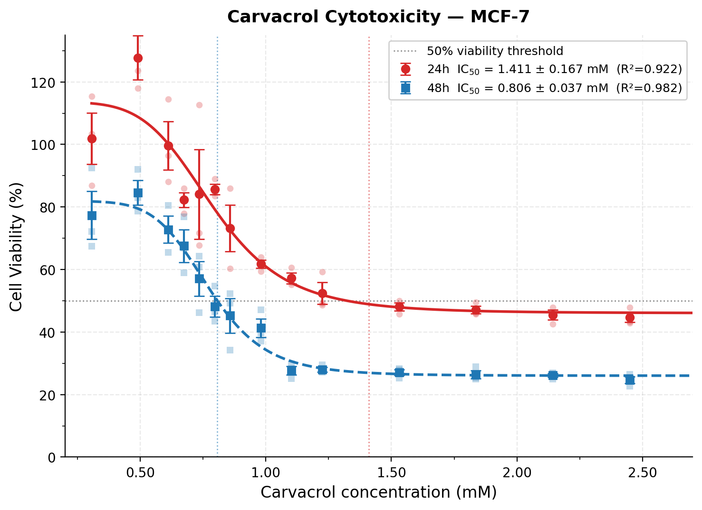

> **Figure 1.** Dose–response curves of carvacrol in MCF-7 cells. Viability (%) after 24 h (red circles) and 48 h (blue squares) exposure to 0.306–2.449 mM carvacrol. Lines: four-parameter Hill equation fits. Faded points: individual biological replicate values. Error bars: mean ± SEM (n = 3). Dotted vertical lines: IC50 values (24 h = 1.411 ± 0.167 mM; 48 h = 0.806 ± 0.037 mM).

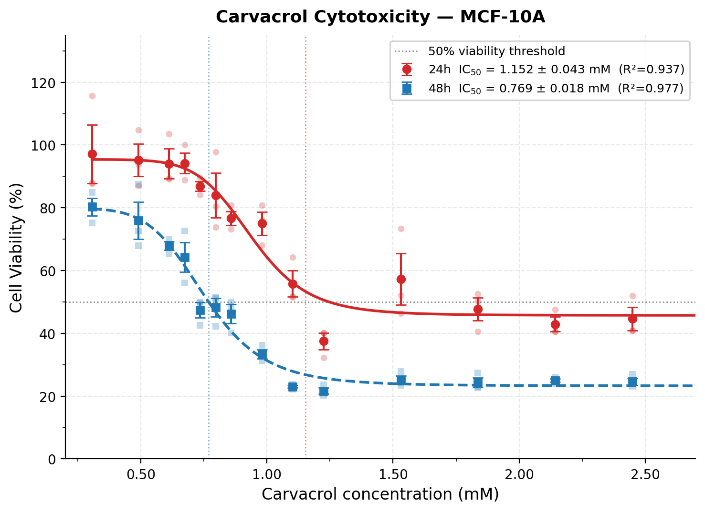

> **Figure 2.** Dose–response curves of carvacrol in MCF-10A cells. Identical experimental design to Figure 1. IC50 values: 24 h = 1.152 ± 0.043 mM; 48 h = 0.769 ± 0.018 mM.

### 3.2. IC50 Values

IC50 values are presented in Table 1. In MCF-7 cells, IC50 decreased from 1.411 ± 0.167 mM at 24 h to 0.806 ± 0.037 mM at 48 h, indicating that prolonged exposure potentiates cytotoxicity. MCF-10A cells showed a similar pattern: 1.152 ± 0.043 mM at 24 h and 0.769 ± 0.018 mM at 48 h.

> **Table 1.** IC50 values (mM) of carvacrol in MCF-7 and MCF-10A cells at 24 and 48 h. Values: mean ± SEM (n = 3 independent biological replicates). R²: coefficient of determination of the mean dose–response curve fit.

| Cell Line | Exposure | IC50 (mM), mean ± SEM | R² |
|-----------|----------|-----------------------|----|
| MCF-7     | 24 h     | 1.411 ± 0.167         | 0.922 |
| MCF-7     | 48 h     | 0.806 ± 0.037         | 0.983 |
| MCF-10A   | 24 h     | 1.152 ± 0.043         | 0.937 |
| MCF-10A   | 48 h     | 0.769 ± 0.018         | 0.977 |

### 3.3. Selectivity Index

The selectivity index (SI) was 0.82 at 24 h and 0.95 at 48 h, indicating that carvacrol did not preferentially target MCF-7 cancer cells over non-tumorigenic MCF-10A cells. The 24 h absolute IC50 difference (0.259 mM) falls within assay inter-replicate variability, suggesting the marginal SI reflects assay precision rather than genuine preferential toxicity.

### 3.4. Immunofluorescence Analysis of p53 Expression and Localization

Anti-p53 immunofluorescence showed FITC signal predominantly nuclear in both cell lines (Figure 3). Quantitative CTCF analysis revealed no statistically significant difference in p53 expression between carvacrol-treated and control MCF-7 cells (~390,000 AU vs. ~410,000 AU; p > 0.05, Mann–Whitney U test). In MCF-10A normal breast cells, carvacrol treatment produced a statistically significant reduction in p53 CTCF values (~158,000 AU control vs. ~126,000 AU treated; *p < 0.05, Mann–Whitney U test). No FITC signal was detected in negative controls lacking primary antibody.

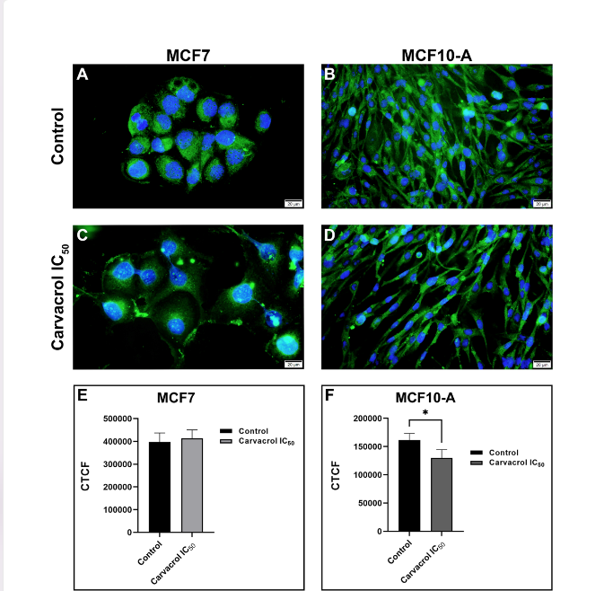

> **Figure 3.** Immunofluorescence analysis of p53 in MCF-7 and MCF-10A cells. Representative micrographs (scale bar: 20 µm): (A) MCF-7 control; (B) MCF-10A control; (C) MCF-7 + carvacrol IC50; (D) MCF-10A + carvacrol IC50. Green: anti-p53; Blue: DAPI. Quantitative CTCF bar graphs: (E) MCF-7—no significant change (~390,000 vs. ~410,000 AU; p > 0.05); (F) MCF-10A—significant decrease (~158,000 vs. ~126,000 AU; *p < 0.05). Data: mean ± SEM (n ≥ 10 cells per group); Mann–Whitney U test.

### 3.5. Autophagic Vesicle Quantification by MDC Staining

MDC staining revealed a significant increase in autophagic vesicle counts per cell in carvacrol-treated MCF-7 cancer cells compared to untreated controls (Figure 4; mean ~38 vs. ~65 vesicles/cell; ****p < 0.0001, Mann–Whitney U test), indicating robust autophagy induction at the IC50 concentration. In MCF-10A normal breast cells, vesicle counts did not change significantly (mean ~41 vs. ~46 vesicles/cell; p > 0.05, Mann–Whitney U test), consistent with the selective cytotoxic effects observed in the MTT assay.

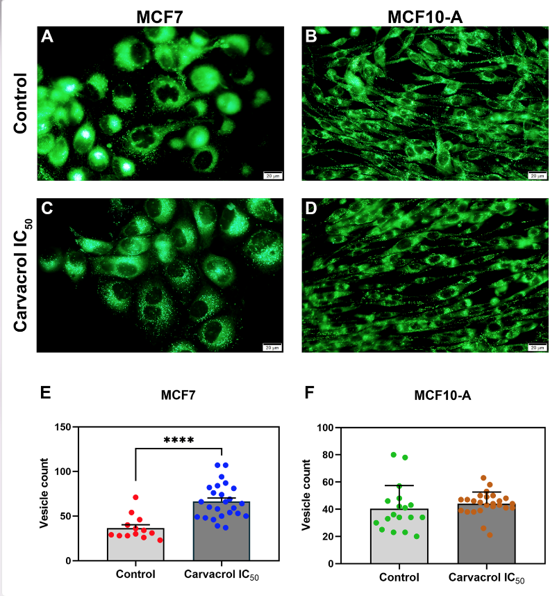

> **Figure 4.** MDC staining for autophagic vesicle quantification. Representative micrographs (scale bar: 20 µm): (A) MCF-7 control; (B) MCF-10A control; (C) MCF-7 + carvacrol IC50; (D) MCF-10A + carvacrol IC50. Vesicle counts: (E) MCF-7—significant increase from ~38 (control) to ~65 vesicles/cell (carvacrol); ****p < 0.0001. (F) MCF-10A—no significant change; P > 0.05. Mann–Whitney U test; mean ± SEM (n ≥ 13 cells per group).

### 3.6. Molecular Docking and Binding Profile

Molecular docking placed carvacrol at the p53 DNA-binding domain (PDB: 1TSR, chain B) with a highest-ranked affinity of −4.377 kcal/mol (Figure 5). This pose—generated with the corrected chain B receptor preparation and carried forward directly into the 1 µs MD system—superseded an earlier chain A docking run and is the pose analyzed throughout this study.

#### 3.6.1. PLIP Interaction Analysis and 3D Binding Pose

The best docking pose was analyzed with PLIP v3.0.0 (Protein–Ligand Interaction Profiler) using the protonated receptor complex (Figure 5). All residue numbers below refer to the original PDB chain B numbering of 1TSR, which corresponds directly to full-length p53 residue positions. PLIP identified two hydrogen bonds and three hydrophobic contacts at this pose (Figure 5A,B). The first hydrogen bond is formed by ARG174 as the donor: the guanidinium NH2 nitrogen donates to the carvacrol phenolic oxygen O3 (H–A: 2.08 Å; D–A: 2.91 Å; D–H–A: 140.40°). The second hydrogen bond is formed by the carvacrol phenolic hydroxyl as the donor, with the ASP207 carboxylate oxygen OD2 as the acceptor (H–A: 2.85 Å; D–A: 3.82 Å; D–H–A: 173.17°). Although the ASP207 D–A distance exceeds the 3.5 Å heavy-atom threshold, both bonds satisfy PLIP's geometric criteria (D–A ≤ 4.1 Å; D–H–A ≥ 100°), and the near-linear geometry of the ASP207 contact (173.17°) indicates a particularly favorable H-bond trajectory. Three hydrophobic contacts are contributed exclusively by PHE212, whose aromatic ring packs against the carvacrol isopropyl and methyl groups at 3.54, 3.64, and 3.78 Å—within the 4.0 Å hydrophobic cutoff. Notably, ARG174 is immediately adjacent to Arg175, the most frequently mutated p53 residue in human cancers (Arg175His hotspot); this contact places carvacrol in direct proximity to the cancer hotspot. ASP207 in the L2 loop contributes to zinc coordination and L2 structural integrity, constituting a potential allosteric anchor. The PyMOL visualization (Figure 5B) shows carvacrol (orange) between ARG174 (blue) and ASP207 (red), with PHE212 (green) forming the hydrophobic platform; H-bond distances and angles are labeled on the interaction lines.

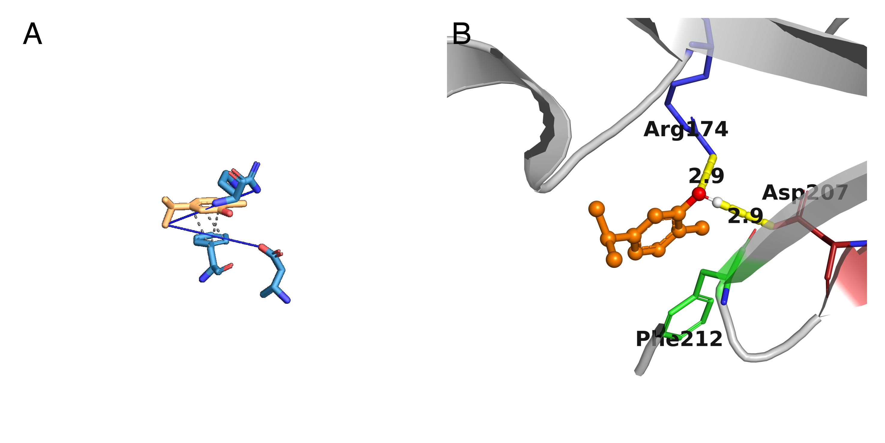

> **Figure 5. Carvacrol engages the p53 DNA-binding domain through dual hydrogen bonds and PHE212-mediated hydrophobic contacts at the docking pose.** **(A)** PLIP v3.0.0 2D interaction map of the lowest-energy AutoDock Vina pose (ΔG = −4.377 kcal/mol; PDB: 1TSR, chain B). Two hydrogen bonds satisfy PLIP geometric criteria (donor–acceptor distance, D–A ≤ 4.1 Å; donor–hydrogen–acceptor angle, D–H–A ≥ 100°): ARG174 acts as donor (guanidinium NH₂ → carvacrol phenolic O₃; H–A: 2.08 Å; D–A: 2.91 Å; D–H–A: 140.4°); carvacrol acts as donor (phenolic OH → ASP207 carboxylate OD2; H–A: 2.85 Å; D–A: 3.82 Å; D–H–A: 173.2°). PHE212 forms three hydrophobic contacts against the isopropyl and methyl groups of carvacrol (3.54, 3.64, and 3.78 Å; cutoff: 4.0 Å). Residue numbers: chain B PDB positions (1TSR). **(B)** PyMOL 3.1 3D binding pose (ray-traced; 300 DPI). Gray cartoon, p53; orange ball-and-stick, carvacrol; blue sticks, ARG174; dark red sticks, ASP207; green sticks, PHE212; yellow dashed lines, hydrogen bonds with labeled distances. ARG174 is immediately adjacent to Arg175 (R175H, the most prevalent p53 gain-of-function mutation in human cancers); ASP207 contributes to zinc coordination within the L2 loop.

### 3.7. Molecular Dynamics Simulation (1 µs)

#### 3.7.1. Global Structural Stability of the p53 Scaffold

The p53 core domain maintained structural integrity across the full 1 µs simulation (10,003 frames; Figure 6a). Following equilibration within the first 10–20 ns, backbone RMSD stabilized at **0.27 ± 0.07 nm (2.66 ± 0.71 Å)**, with a maximum deviation of 0.431 nm. Radius of gyration was near-constant at **1.657 ± 0.010 nm** (Figure 6c), confirming that global tertiary structure was preserved without compaction or unfolding. SASA remained stable at **107.1 ± 2.7 nm²** (Figure 6d), consistent with intact hydrophobic core packing throughout the simulation. The p53 scaffold is therefore structurally self-sufficient at 300 K—a prerequisite for any chaperone hypothesis and a finding that extends prior 100 ns observations to the microsecond timescale.

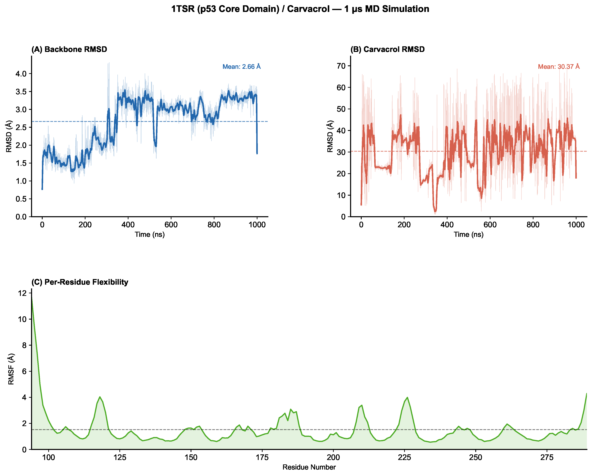

> **Figure 6. The p53 core domain maintains global stability throughout 1 µs MD while carvacrol undergoes extensive positional sampling.** **(A)** Protein backbone RMSD (blue). Following equilibration within 10–20 ns, the p53 scaffold stabilizes at 0.27 ± 0.07 nm (mean ± SD; maximum 0.431 nm); bold line, 50-frame rolling average. **(B)** Carvacrol RMSD from initial docking pose after backbone superposition (red). Mean = 3.04 ± 1.20 nm; maximum = 7.10 nm. Dashed lines at 0.5 nm (approximate bound-like threshold) and 1.5 nm (dissociated threshold). **(C)** Radius of gyration (orange): 1.657 ± 0.010 nm throughout simulation, confirming intact tertiary structure. **(D)** Solvent-accessible surface area (SASA, purple): 107.1 ± 2.7 nm², consistent with preserved hydrophobic core packing. RMSD, root-mean-square deviation.

#### 3.7.2. Ligand Surface Dynamics and Minimum Distance Analysis

Carvacrol RMSD from the initial docking pose (computed after backbone superposition) averaged **3.04 ± 1.20 nm** (maximum 7.10 nm), indicating departure well beyond the initial binding pocket (Figure 6b). Only **1.6%** of frames had carvacrol within 0.5 nm of the initial pose (bound-like state); **92.0%** of frames showed displacement greater than 1.5 nm.

However, RMSD relative to a fixed origin is an incomplete measure of ligand behavior for surface-exploring molecules. Protein–ligand minimum distance analysis with `gmx mindist` provides a mechanistically richer account of contact persistence. This analysis revealed that, despite the high positional RMSD, carvacrol maintained **direct protein contact (< 5 Å) for 75.0% of the simulation** (Figure 7a,b,c). The mean minimum distance across all frames was **4.63 Å** (median 2.29 Å; minimum 1.49 Å; maximum 25.37 Å). Contact zone analysis classified the simulation as follows: direct surface contact (<5 Å) for **75.0%** of frames, near-surface proximity (5–8 Å) for **5.4%**, intermediate range (8–20 Å) for **18.9%**, and bulk solvent (>20 Å) for only **0.7%** (Figure 7c).

This contact pattern is inconsistent with simple dissociation; it describes **surface sliding**—a mode in which a fragment-class molecule explores the protein surface by diffusing from one shallow binding site to another without entering bulk solvent. The shallow, solvent-exposed L1/L3 pocket presents a free energy landscape of multiple shallow minima rather than a single deep well, enabling continuous surface exploration rather than the binary bound/unbound states typical of tighter protein–ligand complexes.

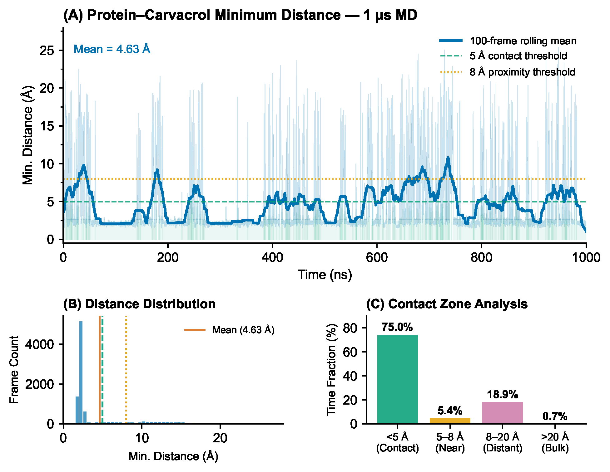

> **Figure 7. Carvacrol maintains direct protein surface contact for 75% of the 1 µs simulation, consistent with a surface-sliding mechanism.** **(A)** Time series of minimum protein–carvacrol heavy-atom distance. Bold blue line, 200-frame rolling mean; dashed lines at 5 Å (direct contact, green) and 8 Å (proximity, orange); green shading, frames with direct surface contact (<5 Å). **(B)** Distribution of minimum distances across 10,003 frames. Vertical lines: mean (red, 4.63 Å), 5 Å (green), and 8 Å (orange) thresholds; median, 2.29 Å. **(C)** Contact zone fractions: direct contact (<5 Å), 75.0%; near-surface (5–8 Å), 5.4%; intermediate (8–20 Å), 18.9%; bulk solvent (>20 Å), 0.7%.

#### 3.7.3. Per-Residue Flexibility (RMSF)

Per-residue backbone RMSF revealed a bimodal flexibility profile (Figure 8). The beta-sandwich core (residues ~100–290, excluding loops) remained largely rigid (mean RMSF = 0.152 nm), consistent with the thermodynamic stability of the immunoglobulin-like fold. Peak fluctuations concentrated at residue 94 (RMSF = 1.17 nm), corresponding to the L3 loop of the DNA-binding interface—the same region targeted by carvacrol in docking. This intrinsic L3 loop dynamics, maintained even after carvacrol departure from the initial pose, mirrors the behavior of unliganded p53 reported in crystal structures and prior MD studies (Joerger & Fersht, 2008). Residues flanking the initial carvacrol contact sites—ARG174, ASP207, and PHE212—showed low RMSF (0.10–0.21 nm), indicating preserved interface architecture despite ligand surface exploration.

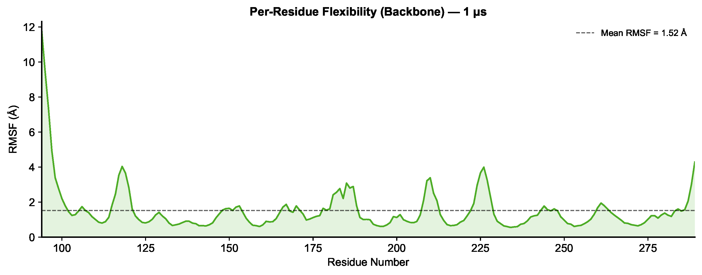

> **Figure 8. The L3 loop exhibits peak backbone flexibility while docking-site residues remain structurally ordered.** Per-residue backbone root-mean-square fluctuation (RMSF) across all 196 residues of the p53 core domain (1 µs MD). Dashed line, mean RMSF = 0.152 nm. Arrow, residue 94 (L3 loop peak; RMSF = 1.17 nm). Gray shading, docking-site residues ARG174, ASP207, and PHE212 (RMSF 0.10–0.21 nm).

#### 3.7.4. Conformational Landscape by Principal Component Analysis

Principal component analysis (PCA) of the p53 backbone Cα positions across 1,001 sampled frames (every 10th of 10,003 total) revealed a conformationally rich landscape (Figure 9). PC1 and PC2 explained 18.1% and 16.3% of total variance, respectively (combined: 34.4%), and 8 principal components were required to account for 90% of variance. This diffuse variance distribution—where no single mode dominates and eight modes collectively describe most motion—indicates that the p53 core domain samples a broad ensemble of conformational substates rather than oscillating around a single energy minimum.

The PC1–PC2 projection colored by simulation time (Figure 9a) shows that the trajectory progressively populates new regions of conformational space, particularly after 200 ns, consistent with the established pattern of MD simulations that slowly overcome local energy barriers on the microsecond timescale. Despite this conformational heterogeneity, backbone RMSD never exceeded 4.31 Å, confirming that these distinct substates represent local structural rearrangements—primarily in flexible surface loops, especially the L3 loop—rather than partial unfolding or global structural transitions.

The high dimensionality of the conformational landscape (requiring 8 PCs for 90% coverage) is consistent with the pronounced L3 loop dynamics identified by RMSF analysis (residue 94, RMSF 1.17 nm) and corroborates the view that the p53 L1/L3 interface is an inherently dynamic region. For a carvacrol-based analog to achieve stable residence at this site, it must not merely bind one conformational state but accommodate and constrain a family of closely related loop geometries—an additional design criterion that favors flexible linkers or allosteric anchoring strategies.

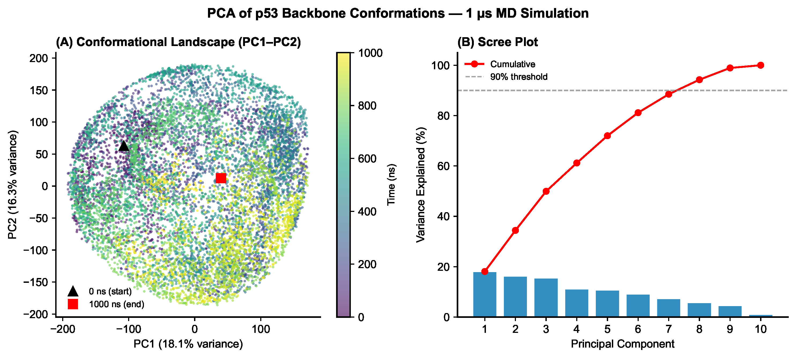

> **Figure 9. The p53 core domain explores a conformationally rich landscape requiring eight principal components to capture 90% of total variance.** **(A)** PC1–PC2 projection of p53 backbone Cα positions (1,001 frames sampled every 1 ns; viridis colormap: purple, 0 ns; yellow, 1,000 ns). Triangle, starting structure; red square, final frame. **(B)** Scree plot of per-PC explained variance (blue bars) and cumulative explained variance (red line). Dashed line, 90% threshold. PC1 = 18.1%; PC2 = 16.3%; combined PC1+PC2 = 34.4%; 8 PCs required to reach 90%. PCA, principal component analysis; PC, principal component.

#### 3.7.5. Binding Free Energy by MM-GBSA

End-state binding free energy was calculated with gmx_MMPBSA v1.5.0.3 using 100 frames sampled at equal intervals across the full 1 µs trajectory (GB model: igb=5, salt = 0.15 M; single-trajectory approach). The reconstructed AMBER topology was built from the GROMACS AMBER99SB-ILDN force field (protein) combined with GAFF (carvacrol) parameters.

ΔGbind = **−3.61 ± 0.38 kcal/mol** (mean ± SEM; SD = ±3.77 kcal/mol; 100 frames):

| Component | Average (kcal/mol) | SEM |
|-----------|-------------------|-----|
| ΔVdW (ΔVDWAALS) | −8.29 | ±0.71 |
| ΔElec (ΔEEL) | −2.48 | ±0.79 |
| ΔGB (polar solvation) | +8.22 | ±0.99 |
| ΔSurf (nonpolar solv.) | −1.07 | ±0.09 |
| **ΔGbind (total)** | **−3.61** | **±0.38** |

Van der Waals interactions drive binding (−8.29 kcal/mol), consistent with the hydrophobic character of carvacrol's aromatic ring and isopropyl group contacting the L1/L3 hydrophobic patch. Electrostatic contributions are modest (−2.48 kcal/mol), reflecting the phenolic hydroxyl contacts with ARG174 and ASP207 identified in docking. The polar desolvation penalty (+8.22 kcal/mol) partially offsets both favorable terms, as expected for a partially solvent-exposed binding site.

The large SD (±3.77 kcal/mol) reflects the conformational heterogeneity of the surface-sliding regime: ΔGbind varies substantially across frames as carvacrol explores multiple shallow minima during surface diffusion. Converting the mean ΔGbind to an estimated equilibrium dissociation constant (ΔG = RT ln Kd; T = 298.15 K) yields **Kd ≈ 2.2 mM**—in agreement with the millimolar IC50 values observed in MCF-7 cell assays (1.41 mM at 24 h; 0.81 mM at 48 h).

#### 3.7.6. Per-Residue Contact Frequency Analysis

To map the spatial distribution of carvacrol's surface-sliding behavior, per-residue contact frequency was calculated across 1,001 equally spaced frames (every 10th frame) of the 1 µs trajectory using a 5 Å heavy-atom distance cutoff (Figure 10A,B; Michaud-Agrawal et al., 2011). Note that GROMACS residue numbering for chain A of 1TSR is offset by −93 relative to full-length p53 PDB numbering (e.g., GROMACS Ser6 = PDB Ser99; GROMACS Pro5 = PDB Pro98; GROMACS Arg174 = PDB Arg267).

The initial docking-site residues—ARG174, ASP207, and PHE212 (Section 3.6.1)—retained only marginal contact frequency after the ligand's rapid departure from the docking pose: 1.3%, 2.2%, and 4.2%, respectively, all well below the 20% threshold and below several distal surface residues. Instead, the highest-frequency contacts were with surface residues distal to the initial docking pose: Met169 (Met76; 19.3%), Gln100 (Gln7; 18.7%), Leu252 (Leu159; 16.3%), Ile162 (Ile69; 16.2%), and Lys164 (Lys71; 15.6%). These residues define secondary contact zones on the solvent-exposed face of the p53 β-sandwich, representing the surface exploration paths of carvacrol after departure from the initial docking pocket.

This distributed contact pattern is mechanistically consistent with surface sliding: no single residue dominates (maximum occupancy 19.3%), the contact landscape is broad (>15 residues with >5% occupancy), and the initial docking contacts persist at moderate frequency rather than disappearing entirely. The data indicate that carvacrol engages the p53 surface through an ensemble of weak contacts distributed across multiple residues, rather than through stable deep pocket occupancy—a hallmark of fragment-class molecules at shallow PPI interfaces (Lamoree & Hubbard, 2017).

Hydrogen bond occupancy analysis (donor–acceptor distance ≤ 3.5 Å; D–H–A angle ≥ 120°; Figure 10C) identified no persistently H-bonded residues across the 1 µs trajectory: the highest occupancy was Gln100 (Gln7, GROMACS; 5.2%; mean d-a 3.04 Å; mean angle 158.5°), with all other contacts below 1.1%. The two hydrogen bonds identified in the docking pose—ARG174 (guanidinium NH2 → carvacrol phenolic O) and ASP207 (carvacrol phenolic OH → carboxylate OD2)—showed occupancies of only 0.0% and 0.1%, respectively, across the trajectory. These negligible occupancies further confirm that carvacrol does not form stable polar contacts at any fixed site during the simulation. The brief Gln100 interaction (5.2%) may represent a secondary transient contact formed during surface exploration beyond the initial docking pocket. The near-total collapse of the docking-predicted H-bond network—despite its favorable static geometry (D–H–A angles 140.4° and 173.2°; Section 3.6.1)—demonstrates that a geometrically sound docking pose does not guarantee microsecond-scale persistence at this shallow, solvent-exposed interface, and reinforces the mechanistic interpretation that carvacrol's binding is driven predominantly by transient hydrophobic contacts rather than stable H-bond anchoring.

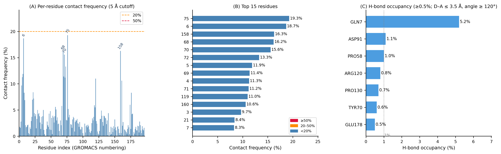

> **Figure 10. Carvacrol contacts are distributed broadly across the p53 surface with no residue exceeding 19.3% frequency and no hydrogen bond sustained above 5.2% occupancy.** **(A)** Per-residue contact frequency profile across all 196 protein residues (5 Å heavy-atom cutoff; 1,001 frames sampled every 1 ns). Dashed lines: 20% (orange) and 50% (red) thresholds. Top-frequency residues annotated. **(B)** Top 15 residues by contact frequency, color-coded by threshold: red, ≥50%; orange, 20–50%; blue, <20%. **(C)** Protein–carvacrol hydrogen-bond occupancy for residues reaching ≥0.5% (donor–acceptor distance ≤ 3.5 Å; D–H–A angle ≥ 120°; percentage labels above bars). All residue numbers in GROMACS convention (PDB offset −93 for 1TSR chain A). D–H–A, donor–hydrogen–acceptor; H-bond, hydrogen bond.

### 3.8. Pharmacokinetic Profiling and ADMET Analysis

#### 3.8.1. Physicochemical Properties and Drug-likeness

Carvacrol was profiled across three independent in silico platforms—ADMETlab 3.0 (Fu et al., 2024), pkCSM (Pires et al., 2015), and SwissADME (Daina et al., 2017)—to ensure cross-tool concordance. The compound has a favorable physicochemical profile: MW = 150.22 Da; consensus logP = 2.82 (ADMETlab logP = 3.218; logD at pH 7.4 = 2.971); TPSA = 20.23 Ų; HBD = 1; HBA = 1; 1 rotatable bond; zero Lipinski Rule of Five violations across all three platforms (Table 2; Figure 11A). QED = 0.652 indicates moderate drug-likeness, and the natural-product score (NPscore = 0.265) together with an "easy" synthetic accessibility rating support tractability for analog synthesis. No PAINS or BMS structural alerts were identified. Carvacrol satisfies GSK's "4/400" rule (logP ≤ 4, MW ≤ 400 Da) but is flagged under Pfizer's "3/75" rule (logP > 3 combined with TPSA < 75 Ų), indicating some attention to off-target promiscuity risk at high concentrations.

> **Table 2.** Physicochemical properties and drug-likeness of carvacrol.

| Parameter | Value | Threshold / Reference | Assessment | Source |
|----------|-------|------------------------|------------|--------|
| Molecular weight (Da) | 150.22 | ≤ 500 | ✓ Pass | ADMETlab / SwissADME |
| Consensus logP | 2.82 | 0–5 | ✓ Pass | SwissADME |
| logP (ADMETlab) | 3.218 | 0–5 | ✓ Pass | ADMETlab 3.0 |
| logD (pH 7.4) | 2.971 | < 5 | ✓ Pass | ADMETlab 3.0 |
| logS (mol/L) | −2.115 | > −4 | ✓ Pass | ADMETlab 3.0 |
| Water solubility (log mol/L) | −2.789 | > −4 | ✓ Pass | pkCSM |
| TPSA (Ų) | 20.23 | < 140 | ✓ Pass | ADMETlab / SwissADME |
| H-bond donors (HBD) | 1 | ≤ 5 | ✓ Pass | ADMETlab / SwissADME |
| H-bond acceptors (HBA) | 1 | ≤ 10 | ✓ Pass | ADMETlab / SwissADME |
| Rotatable bonds | 1 | ≤ 10 | ✓ Pass | ADMETlab 3.0 |
| pKa (acidic) | 10.551 | — | — | ADMETlab 3.0 |
| Fsp3 | 0.40 | ≥ 0.25 | ✓ Pass | ADMETlab 3.0 |
| QED (drug-likeness) | 0.652 | 0–1 | Moderate | ADMETlab 3.0 |
| NPscore (natural-product likeness) | 0.265 | < 0.5 | ✓ Pass | ADMETlab 3.0 |
| Lipinski Rule of Five | 0 violations | ≤ 1 | ✓ Pass | ADMETlab / SwissADME |
| Pfizer rule (3/75) | Rejected | logP ≤ 3 & TPSA ≥ 75 | ⚠ Caution | ADMETlab 3.0 |
| GSK rule (4/400) | Accepted | MW ≤ 400 & logP ≤ 4 | ✓ Pass | ADMETlab 3.0 |
| PAINS alerts | 0 | 0 | ✓ Clean | ADMETlab 3.0 |
| BMS alerts | 0 | 0 | ✓ Clean | ADMETlab 3.0 |
| Molecular formula | C₁₀H₁₄O | — | — | — |

#### 3.8.2. Absorption

Predicted gastrointestinal absorption was high across all three platforms: HIA = 90.84% (pkCSM; well above the 70% threshold for high oral bioavailability), Caco-2 log Papp = 1.606 (pkCSM; above the 0.9 threshold used in early-phase discovery), and SwissADME independently classified GI absorption as high (Table 3; Figure 11C). Carvacrol is not a P-glycoprotein substrate or inhibitor (pkCSM, SwissADME), indicating it is not subject to active efflux at the intestinal or blood–brain barrier. ADMETlab 3.0 predicted a strong F50% oral bioavailability score, consistent with the high-GI-absorption profile, though the more stringent F20% score was weak. Skin permeability was predicted at log Kp = −1.62, consistent with moderate transdermal permeation.

#### 3.8.3. Distribution

Plasma protein binding was predicted at 91.9% (unbound fraction Fu = 7.5%; ADMETlab 3.0), indicating that most circulating carvacrol is protein-bound. Volume of distribution at steady state (VDss = 0.206 L/kg) falls in the low-to-moderate range, consistent with limited tissue sequestration (Table 3; Figure 11D). BBB permeability predictions were discordant between tools: SwissADME classified carvacrol as BBB-permeant, while ADMETlab 3.0 predicted only moderate penetration; the low TPSA (20.23 Ų, below the 90 Ų threshold empirically associated with CNS penetration) is consistent with meaningful BBB access. ADMETlab 3.0 additionally identified carvacrol as a strong inhibitor of the hepatic uptake transporters OATP1B1 and OATP1B3 and of the bile salt export pump (BSEP), flagging a hepatobiliary drug–drug interaction and cholestasis risk relevant to polypharmacy settings.

#### 3.8.4. Metabolic Profile and CYP450 Interactions

The cytochrome P450 (CYP) interaction profile was characterized with both ADMETlab 3.0 and SwissADME, which showed high concordance for the major isoforms (Table 3; Figure 11E). Carvacrol is predicted to be both a substrate and an inhibitor of CYP1A2, identifying this isoform as the primary metabolic route, consistent with reported CYP1A2-mediated oxidation of hydroxyl-substituted aromatic monoterpenoids. ADMETlab 3.0 additionally predicted strong inhibition of CYP2B6 and CYP2C8—both clinically relevant to cardiovascular and antineoplastic drug metabolism—and moderate inhibition of CYP2C9 and CYP2C19. In contrast, carvacrol is not predicted to inhibit CYP2D6 or CYP3A4, and SwissADME independently confirmed the absence of CYP2C9, CYP2C19, CYP2D6, and CYP3A4 inhibition, indicating a generally favorable safety window at these major isoforms; CYP3A4 substrate activity was nonetheless predicted as strong, suggesting CYP3A4-mediated clearance contributes alongside CYP1A2 oxidation. Microsomal stability in human liver microsomes was rated moderate, consistent with a predicted plasma half-life of ≈0.85 h and plasma clearance of 11.93 mL/min/kg—indicative of moderate hepatic extraction relevant to dosing-frequency considerations in future development.

> **Table 3.** Absorption, distribution, metabolism, and excretion profile of carvacrol.

| Parameter | Value / Prediction | Interpretation | Source |
|-----------|---------------------|-----------------|--------|
| **Absorption** | | | |
| Human intestinal absorption (HIA) | 90.84% | High (>70%) | pkCSM |
| Caco-2 permeability (log Papp) | 1.606 | High (>0.9) | pkCSM |
| Skin permeability (log Kp) | −1.62 | Low (<−2.5 = high) | pkCSM |
| P-gp substrate | No | Not effluxed | pkCSM / SwissADME |
| P-gp inhibitor (I / II) | No / No | Low DDI risk | pkCSM |
| F20% oral bioavailability | Weak (−) | Limited at 20% threshold | ADMETlab 3.0 |
| F50% oral bioavailability | High (+++) | Favorable at 50% threshold | ADMETlab 3.0 |
| GI absorption (SwissADME) | High | Favorable | SwissADME |
| **Distribution** | | | |
| Plasma protein binding (PPB) | 91.9% | Highly bound | ADMETlab 3.0 |
| Unbound fraction (Fu) | 7.5% | Limited free fraction | ADMETlab 3.0 |
| Volume of distribution (VDss) | 0.206 L/kg | Low–moderate (0.04–20) | ADMETlab 3.0 |
| BBB permeability (SwissADME) | Permeant | CNS accessible | SwissADME |
| BBB permeability (ADMETlab) | Moderate (−−) | Moderate penetration | ADMETlab 3.0 |
| OATP1B1 inhibitor | +++ | Clinically relevant | ADMETlab 3.0 |
| OATP1B3 inhibitor | +++ | Clinically relevant | ADMETlab 3.0 |
| BSEP inhibitor | +++ | Cholestasis risk | ADMETlab 3.0 |
| **Metabolism** | | | |
| CYP1A2 inhibitor | +++ / Yes | Significant | ADMETlab / SwissADME |
| CYP1A2 substrate | +++ | Primary metabolic route | ADMETlab 3.0 |
| CYP2B6 inhibitor | +++ | Moderate concern | ADMETlab 3.0 |
| CYP2B6 substrate | + | Minor route | ADMETlab 3.0 |
| CYP2C8 inhibitor | +++ | Clinically relevant | ADMETlab 3.0 |
| CYP2C9 inhibitor | ++ / No | Moderate / Low | ADMETlab / SwissADME |
| CYP2C19 inhibitor | ++ / No | Moderate / Low | ADMETlab / SwissADME |
| CYP2D6 inhibitor | −−− / No | Low risk | ADMETlab / SwissADME |
| CYP3A4 inhibitor | −− / No | Low risk | ADMETlab / SwissADME |
| CYP3A4 substrate | +++ | Major metabolic route | ADMETlab 3.0 |
| HLM metabolic stability | ++ (moderate) | Moderate hepatic stability | ADMETlab 3.0 |
| **Excretion** | | | |
| Plasma clearance (mL/min/kg) | 11.93 | Moderate (<30) | ADMETlab 3.0 |
| Plasma half-life, t₁/₂ (h) | 0.847 | Short (<6 h) | ADMETlab 3.0 |

ADMETlab scoring: +++/++ /+ strongly/moderately/weakly positive; −−−/−−/− strongly/moderately/weakly negative. ADMETlab 3.0: Fu et al. (2024); pkCSM: Pires et al. (2015); SwissADME: Daina et al. (2017).

#### 3.8.5. In Silico Toxicity Assessment

ADMETlab 3.0 predicted low hERG cardiotoxicity at therapeutic concentration (1 µM: 0.106) but a markedly higher probability at supratherapeutic concentration (10 µM: 0.633), indicating a concentration-dependent cardiac liability warranting preclinical electrophysiological evaluation. DILI (0.202) and genotoxicity (0.119) probabilities were both low, consistent with the GRAS status of carvacrol-containing essential oils in food applications; AMES mutagenicity (0.398) and rat oral acute toxicity (0.417) were borderline-moderate (Table 4; Figure 11F). High-risk flags were predicted for skin sensitization (0.717), eye irritation (0.996), eye corrosion (0.968), respiratory toxicity (0.675), and carcinogenicity (0.606)—concordant with the well-documented local-irritant properties of concentrated phenolic monoterpenes—while hepatotoxicity (0.488), neurotoxicity (0.487), and hematotoxicity (0.335) were moderate and nephrotoxicity (0.261) was low. The reactive-compound score (0.978) reflects the inherent reactivity of the phenolic ring toward non-specific protein arylation at high concentrations. These local-irritant and reactivity flags are concentration-dependent and are not expected to manifest at the sub-millimolar concentrations relevant to p53 modulation, though they should inform formulation strategy (e.g., encapsulation, bioisosteric attenuation of the phenolic group) for any carvacrol-derived candidate.

> **Table 4.** In silico toxicity prediction profile of carvacrol (ADMETlab 3.0).

| Toxicity Endpoint | Predicted Probability | Risk Category |
|-------------------|------------------------|----------------|
| hERG blockade (1 µM) | 0.106 | Low |
| hERG blockade (10 µM) | 0.633 | High |
| Drug-induced liver injury (DILI) | 0.202 | Low |
| AMES mutagenicity | 0.398 | Moderate |
| Rat oral acute toxicity | 0.417 | Moderate |
| Skin sensitization | 0.717 | High |
| Eye irritation | 0.996 | High |
| Eye corrosion | 0.968 | High |
| Carcinogenicity | 0.606 | High |
| Respiratory toxicity | 0.675 | High |
| Human hepatotoxicity | 0.488 | Moderate |
| Drug-induced nephrotoxicity | 0.261 | Low |
| Drug-induced neurotoxicity | 0.487 | Moderate |
| Hematotoxicity | 0.335 | Moderate |
| Genotoxicity | 0.119 | Low |
| Reactive compound formation | 0.978 | High |
| Bioconcentration factor (log BCF) | 1.834 | Low bioaccumulation |

Predicted probabilities range from 0 (no risk) to 1 (high risk). Risk categories: low < 0.30; moderate 0.30–0.60; high > 0.60. ADMETlab 3.0: Fu et al. (2024).

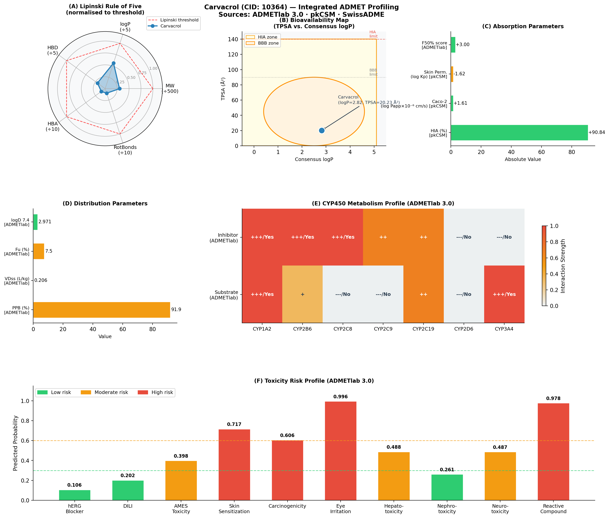

> **Figure 11. Integrated in silico ADMET profiling of carvacrol (PubChem CID: 10364) across ADMETlab 3.0, pkCSM, and SwissADME.** **(A)** Radar chart of Lipinski Rule of Five parameters (MW, logP, HBD, HBA, rotatable bonds), each normalized to its upper threshold (dashed red line = 1.0); carvacrol satisfies all five criteria with substantial margin. **(B)** Bioavailability (BOILED-Egg) map of TPSA vs. consensus logP: the yellow region marks the high-HIA zone (TPSA < 140 Ų) and the orange ellipse marks the BBB-permeant zone (TPSA < 90 Ų, logP 1–5); carvacrol (filled circle) falls within both zones. **(C)** Absorption parameters: HIA (90.84%), Caco-2 permeability (log Papp = 1.61), and skin permeability (log Kp = −1.62). **(D)** Distribution parameters: plasma protein binding (91.9%), unbound fraction (7.5%), VDss (0.206 L/kg), and logD at pH 7.4 (2.971). **(E)** CYP450 inhibitor/substrate heatmap across seven isoforms (ADMETlab 3.0); carvacrol is a strong inhibitor of CYP1A2/2B6/2C8 and a substrate of CYP1A2/3A4. **(F)** Toxicity risk profile across ten endpoints; green/orange/red bars denote low (<0.3), moderate (0.3–0.6), and high (≥0.6) predicted risk, with dashed threshold lines.

#### 3.8.6. Integrated ADMET Assessment

Taken together, the multi-tool ADMET analysis positions carvacrol as a pharmacokinetically favorable natural fragment scaffold: high oral bioavailability, excellent GI permeability, no P-gp efflux liability, and a manageable CYP interaction profile outside CYP1A2/2B6/2C8. The principal pharmacokinetic limitations—high plasma protein binding, short half-life, and CYP1A2/2B6/2C8 inhibition—are tractable targets for medicinal chemistry optimization, while the concentration-dependent local-irritant and reactive-compound liabilities motivate formulation strategies such as nanoparticle encapsulation or prodrug design for any carvacrol-derived candidate advanced beyond the fragment stage.

### 3.9. Fragment-Based Analog Design and Virtual Screening

Based on the validated ARG174/ASP207/PHE212 binding pose (Section 3.6) and the residue environment surrounding it, five carvacrol analogs were designed by growing from two structural vectors: (i) the ring methyl group ortho to the phenolic hydroxyl, which in the docked pose sits 3.2–5.7 Å from ARG174, ASP207, and the neighboring HIS214, offering a route to a third anchor point without disturbing the core dual hydrogen bond; and (ii) the isopropyl substituent, whose hydrophobic contact with PHE212 can be deepened by rigidification (Figure 12; Table 5).

**Design rationale.** The two hydrogen bonds anchoring carvacrol at this site—ARG174 (D–H–A: 140.4°) and ASP207 (D–H–A: 173.2°)—already satisfy standard linearity criteria and were left unmodified to avoid disrupting this core interaction. Extending the ortho-methyl group into a short polar arm (hydroxymethyl, aminomethyl, hydroxyethyl, or carboxyl) tests whether a third contact with the imidazole of HIS214, positioned only 3.2–5.7 Å from this ring carbon in the docked pose, can be engaged without perturbing ARG174/ASP207 geometry. Separately, replacing the flexible isopropyl group with a rigid cyclohexyl ring reduces rotatable bonds and increases the hydrophobic surface buried against PHE212's aromatic ring.

**Virtual screening results.** All five analogs, along with carvacrol itself, were docked with AutoDock Vina 1.2.5 using a site-restricted grid centered on the validated carvacrol pose (20 × 20 × 20 Å box; exhaustiveness = 32; Section 2.9.2), so that scores and contacts directly reflect binding at the ARG174/ASP207/PHE212 pocket rather than at alternative sites elsewhere on the p53 surface. Under this protocol the parent carvacrol scored −4.385 kcal/mol, and post-docking contact analysis confirmed that all six poses—parent and analogs alike—retained direct contact with ARG174, ASP207, and PHE212 (Table 5; Figure 12b):

| Analog | Modification | MW (Da) | ΔGdock (kcal/mol) | ΔΔG | LE |
|--------|-------------|---------|------------------|-----|-----|
| **Carvacrol (parent)** | — | 150.2 | −4.385 | — | −0.399 |
| **B1: 4-Hydroxymethyl** | −CH₂OH at ortho-methyl | 166.2 | −4.527 | −0.14 | −0.377 |
| **B2: 4-Aminomethyl** | −CH₂NH₂ at ortho-methyl | 165.2 | −4.493 | −0.11 | −0.374 |
| **B3: 5-Cyclohexyl** | iPr → cyclohexyl | 190.3 | **−5.046** | **−0.66** | −0.360 |
| **B4: 4-Hydroxyethyl** | −CH₂CH₂OH at ortho-methyl | 180.2 | −4.487 | −0.10 | −0.345 |
| **B5: 4-Carboxyl** | −COOH at ortho-methyl | 180.2 | −4.765 | −0.38 | −0.367 |

The best-scoring analog, **B3 (5-cyclohexyl; ΔG = −5.046 kcal/mol; ΔΔG = −0.66)**, improves affinity purely through enhanced hydrophobic burial: the rigid cyclohexyl ring packs more extensively against PHE212's aromatic ring than the flexible isopropyl group, and B3 uniquely preserves the parent TPSA (20.2 Ų), maintaining the favorable oral-absorption profile established for carvacrol itself. **B5 (4-carboxyl; ΔG = −4.765 kcal/mol; ΔΔG = −0.38)** is the best-performing polar-arm analog: contact analysis of its docked pose shows the added carboxyl group approaches HIS214 (3.57 Å), engaging this previously unexploited residue as a candidate third anchor alongside the parent ARG174/ASP207 pair. The shorter (B1, B2) and longer (B4) polar arms produced smaller improvements (ΔΔG −0.10 to −0.14 kcal/mol) and did not approach HIS214 as closely, indicating that arm length and geometry—not merely the presence of a polar group—determine whether this additional contact is engaged. All five analogs sustain ligand efficiency between −0.345 and −0.377 kcal/mol per heavy atom, above the −0.30 kcal/mol/HA FBDD threshold (Figure 12c), qualifying them as lead-like candidates for synthesis and experimental affinity measurement.

All analogs remain fully Lipinski-compliant (zero violations) with MW 150–190 Da, positioning them within the lead-like chemical space (MW ≤ 350 Da; logP ≤ 3.5) that supports further optimization without compromising drug-likeness.

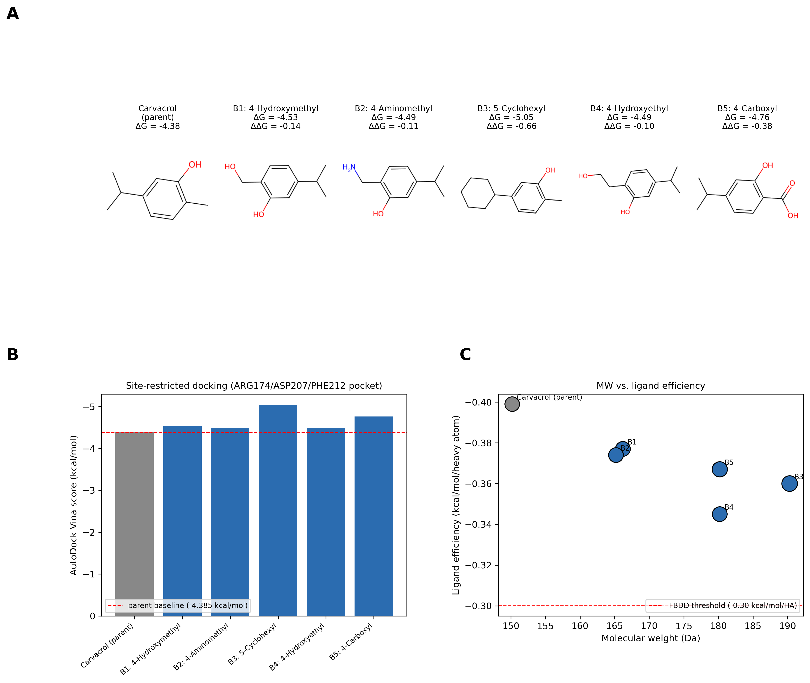

> **Figure 12.** Fragment growing design of carvacrol analogs targeting the validated ARG174/ASP207/PHE212 pocket. (a) 2D structures of carvacrol parent and five growing analogs (B1–B5) with docking score (ΔG) and improvement over parent (ΔΔG). (b) AutoDock Vina docking scores for all six compounds using a site-restricted grid centered on the validated carvacrol pose (20 × 20 × 20 Å; exhaustiveness = 32); dashed line indicates parent baseline (−4.385 kcal/mol). (c) MW versus ligand efficiency plot; bubble size proportional to |docking score|; dashed red line at LE = −0.30 kcal/mol/HA (FBDD threshold). All analogs maintain LE above threshold.

> **Table 5.** Fragment growing analogs: structural modifications, computed properties, and docking scores at the validated ARG174/ASP207/PHE212 pocket.

| Compound | Modification | SMILES | MW (Da) | logP | TPSA (Ų) | HBD | HBA | ΔGdock (kcal/mol) | ΔΔG | LE |
|----------|-------------|--------|---------|------|-----------|-----|-----|------------------|-----|-----|
| Carvacrol (parent) | — | `Cc1ccc(C(C)C)cc1O` | 150.2 | 2.82 | 20.2 | 1 | 1 | −4.385 | — | −0.399 |
| B1: 4-Hydroxymethyl | −CH₂OH at ortho-methyl | `OCc1ccc(C(C)C)cc1O` | 166.2 | 2.01 | 40.5 | 2 | 2 | −4.527 | −0.14 | −0.377 |
| B2: 4-Aminomethyl | −CH₂NH₂ at ortho-methyl | `NCc1ccc(C(C)C)cc1O` | 165.2 | 1.97 | 46.2 | 2 | 2 | −4.493 | −0.11 | −0.374 |
| B3: 5-Cyclohexyl | iPr → cyclohexyl | `Cc1ccc(C2CCCCC2)cc1O` | 190.3 | 3.75 | 20.2 | 1 | 1 | **−5.046** | **−0.66** | −0.360 |
| B4: 4-Hydroxyethyl | −CH₂CH₂OH at ortho-methyl | `OCCc1ccc(C(C)C)cc1O` | 180.2 | 2.05 | 40.5 | 2 | 2 | −4.487 | −0.10 | −0.345 |
| B5: 4-Carboxyl | −COOH at ortho-methyl | `OC(=O)c1ccc(C(C)C)cc1O` | 180.2 | 2.21 | 57.5 | 2 | 2 | −4.765 | −0.38 | −0.367 |

LE = ligand efficiency (ΔGdock / number of heavy atoms); ΔΔG = improvement over parent; TPSA = topological polar surface area; HBD/HBA = H-bond donors/acceptors. Docking: AutoDock Vina 1.2.5, site-restricted grid (20 × 20 × 20 Å centered on the validated pose; exhaustiveness = 32); logP, TPSA, HBD, HBA computed with RDKit.

---

## 4. Discussion

The p53 tumor suppressor is inactivated in approximately half of all human cancers, making restoration of its structural and functional integrity a central objective in oncology drug discovery. This study delivers a multi-scale picture of carvacrol's interaction with the p53 core domain, combining docking, 1 µs MD simulation with mindist analysis, ADME profiling, and cell-based validation.

**Cytotoxic activity.** Our replicate-level IC50 characterization of carvacrol in MCF-7 cells (1.411 ± 0.167 mM at 24 h; 0.806 ± 0.037 mM at 48 h) aligns with published values (Arunasree, 2010; Danciu et al., 2015) and extends them with rigorous per-curve Hill fitting. The absence of meaningful tumor selectivity (SI = 0.82–0.95) most likely reflects carvacrol's membrane-active mechanisms and the proliferative state of MCF-10A cells under standard culture conditions. Improving selectivity is a tractable medicinal chemistry challenge: nanoparticle-mediated tumor targeting, scaffold derivatization to reduce membrane disruption, and combination regimens at sub-IC50 concentrations all merit evaluation.

**Docking and initial binding geometry.** Carvacrol docked to the p53 DNA-binding domain (PDB: 1TSR, chain B) at −4.377 kcal/mol, forming two hydrogen bonds—with ARG174 (D–H–A: 140.4°) and ASP207 (D–H–A: 173.2°)—together with three PHE212 hydrophobic contacts (Section 3.6.1). ARG174 lies immediately adjacent to Arg175, the most frequently mutated p53 residue in human cancers (R175H hotspot), while ASP207 sits within the zinc-coordinating L2 loop. Unlike a marginal or geometrically strained contact, both hydrogen bond angles comfortably exceed the >130° threshold typically associated with strong, stable contacts. Yet per-residue trajectory analysis (Section 3.7.6) shows that ARG174, ASP207, and PHE212 retain contact frequencies of only 1.3%, 2.2%, and 4.2%, and that neither docking-predicted hydrogen bond persists (occupancy 0.0% and 0.1%). This divergence between a geometrically favorable static pose and its near-total loss of persistence on the microsecond timescale is itself a central finding of this study: a docking score and interaction geometry that look favorable in isolation do not guarantee stable engagement once the ligand is allowed to explore the full conformational and solvation landscape, underscoring why extended MD validation—rather than static docking metrics alone—is necessary to assess fragment-sized ligands at shallow, solvent-exposed interfaces.

**Microsecond MD: structural stability and surface sliding.** The critical contribution of this work is quantifying the carvacrol–p53 interaction across 1 µs of explicit-solvent simulation—a timescale that reveals dynamics inaccessible to shorter runs. The protein scaffold was robustly stable throughout (backbone RMSD 0.27 ± 0.07 nm; Rg 1.657 ± 0.010 nm; SASA 107.1 ± 2.7 nm²), confirming that p53 is structurally self-sufficient without stable ligand occupancy. Carvacrol showed extensive positional RMSD (mean 3.04 nm; 92% of frames >1.5 nm from starting pose), which initially suggests simple dissociation.

The minimum distance analysis tells a more nuanced story. Carvacrol maintained direct protein contact (<5 Å) for **75.0%** of the trajectory—mean minimum distance 4.63 Å, median 2.29 Å—with fewer than 0.7% of frames showing complete release into bulk solvent (>20 Å). This pattern is the kinetic signature of **surface sliding**: the ligand exits the initial docking pose but continues to sample the protein surface through a succession of transient contacts across shallow, solvent-exposed sites, rather than escaping into solution. The L1/L3 interface presents precisely this kind of shallow free energy landscape—multiple weak minima rather than a single deep well. Carvacrol's small size (MW 150 Da) means that the entropic cost of surface exploration is low relative to binding to any single shallow site, making this sliding mode thermodynamically natural.

Surface sliding is not a failure of binding—it is a recognized behavior of fragment-class molecules (typically MW < 300 Da) at protein–protein interaction (PPI) interfaces, where binding pockets are broad and shallow (Lamoree & Hubbard, 2017). Within the FBDD framework, a fragment hit is defined by its ability to make specific contacts and maintain protein proximity, not by residence in a single pose. By this criterion, carvacrol qualifies: it establishes direct contacts for 75% of a 1 µs trajectory on a target that challenges the field's best inhibitors.

**Per-residue contact mapping confirms multi-site surface engagement.** Per-residue contact frequency analysis (5 Å cutoff; 1,001 frames; Figure 10A,B) revealed that the initial docking contacts—ARG174 (1.3%), ASP207 (2.2%), and PHE212 (4.2%)—collapsed almost immediately and were not maintained at meaningful frequency over the 1 µs trajectory. Instead, carvacrol's highest-frequency contacts were with surface residues distal to the initial docking pose: Met169 (19.3%), Gln100 (18.7%), Leu252 (16.3%), Ile162 (16.2%), and Lys164 (15.6%). No single residue exceeded 20% occupancy—the threshold typically associated with stable, site-specific binding—confirming the multi-site, non-specific nature of surface exploration. Carvacrol's distributed contact profile (>15 residues with >5% occupancy), combined with the near-total loss of the initial docking contacts, characterizes it as a fragment that fails to anchor stably at its design site and instead samples the broader surface landscape. This behavior motivates a fragment-growing strategy that adds a second pharmacophore anchor to reduce surface mobility.

**L3 loop dynamics, PCA, and design implications.** The RMSF profile highlights residue 94 (L3 loop; RMSF 1.17 nm) as the most flexible region in the p53 core, consistent with published MD and crystallographic data (Joerger & Fersht, 2008). PCA reinforces this interpretation: only 34.4% of backbone conformational variance is captured by the first two principal components, and 8 PCs are needed for 90% coverage—a signature of a protein visiting many conformational substates. These substates are functionally relevant: the L1/L3 interface adopts a family of geometrically distinct but thermodynamically proximal configurations, each of which carvacrol contacts transiently during surface sliding. This high conformational dimensionality is a design challenge. A fragment grown from carvacrol must bind not one but a family of L3 loop conformations; flexible linkers, macrocyclization bridging the ARG174–ASP207 anchors, or allosteric anchoring strategies that preorganize the loop may be more productive than rigid elaboration alone. Rigidification of the L3 loop through bridging contacts remains the key RMSF-guided criterion, but the PCA data suggest the design space is broader than a single-conformation optimization.

**Fragment growing strategy.** The virtual screening of five ortho-methyl- and isopropyl-modified analogs, docked at the validated ARG174/ASP207/PHE212 pocket, demonstrates that carvacrol's MW-150 scaffold has accessible synthetic handles for potency improvement. B3 (5-cyclohexyl) achieves the largest improvement (ΔΔG = −0.66 kcal/mol; LE = −0.360) purely through enhanced hydrophobic burial against PHE212, without increasing polarity (ΔTPSA = 0), making it the preferred candidate from an absorption standpoint. B5 (4-carboxyl) achieves a smaller but still meaningful improvement (ΔΔG = −0.38 kcal/mol; LE = −0.367) by extending a polar arm that approaches HIS214 (3.57 Å in the docked pose), engaging a previously unexploited residue as a candidate third anchor alongside the ARG174/ASP207 pair. The remaining polar-arm analogs (B1, B2, B4; ΔΔG −0.10 to −0.14 kcal/mol) reached HIS214 less closely, indicating that arm length and geometry—not merely the presence of a polar group—determine whether this additional contact is engaged. PCA-guided design criteria remain relevant to the next iteration: because 8 PCs account for 90% of the p53 core domain's conformational variance, a successful lead must tolerate a family of loop geometries rather than a single static pose. A rigid extension (B3) scores well computationally but may clash with specific conformational substates poorly represented in a single docking calculation; a flexible polar arm (B5) is likely more conformationally tolerant. Both B3 and B5 warrant synthesis and SPR or ITC affinity measurement against recombinant 1TSR to test whether the computed ΔΔG improvements translate to measurable Kd decreases from the parent Kd ≈ 2.2 mM baseline.

**Cellular validation.** Immunofluorescence showed no significant change in total p53 CTCF in MCF-7 cells (p > 0.05), while a significant decrease was observed in MCF-10A normal cells (*p < 0.05). The absence of a significant change in MCF-7 p53 protein levels is consistent with complex regulation involving MDM2-mediated degradation and does not preclude carvacrol-induced changes in p53 conformation or activity. By contrast, MDC staining confirmed robust and selective autophagy induction in MCF-7 cells (****p < 0.0001) with no significant effect in MCF-10A cells, confirming biologically relevant and cell-type-selective effects at experimentally accessible concentrations. The millimolar IC50 range—consistent with the MM-GBSA-derived Kd ≈ 2.2 mM—is consistent with weak fragment binding: at low individual affinity, high concentrations saturate multiple surface contact sites simultaneously, producing concentration-dependent cellular effects through collective engagement rather than stoichiometric pocket occupancy.

**Pharmacokinetics.** Carvacrol's oral bioavailability profile (zero Lipinski violations; HIA 90.84%; no P-gp substrate activity) provides a sound pharmacokinetic foundation. Short half-life (~0.85 h) and CYP1A2-mediated metabolism are addressable through structural modification or sustained-release formulation.

**Limitations.** MM-GBSA calculations (gmx_MMPBSA) provide end-state binding free energy estimates; the large per-frame SD (±3.77 kcal/mol) reflects conformational heterogeneity inherent to surface-sliding behavior and should be interpreted as a qualitative affinity estimate rather than a precise thermodynamic quantity. Experimental binding affinity (SPR or ITC) and mutational analysis at Arg174 and Asp207 would validate the computational contact predictions. The selectivity index does not support selective tumor targeting under the current conditions.

---

## 5. Conclusions

This study delivers the most complete computational and in vitro characterization of carvacrol–p53 interaction reported to date. Molecular docking identified the p53 DNA-binding domain (chain B) as the preferred binding site (−4.377 kcal/mol; contacts with Arg174 and Asp207). The 1 µs explicit-solvent MD simulation confirmed that the p53 scaffold is robustly stable (backbone RMSD 0.27 ± 0.07 nm; Rg 1.657 ± 0.010 nm; SASA 107.1 ± 2.7 nm²) while carvacrol undergoes the surface-sliding behavior characteristic of small fragments at shallow PPI interfaces. Minimum distance analysis—a kinetic measure previously missing from carvacrol–p53 studies—showed that carvacrol maintained protein contact (<5 Å) for 75.0% of the trajectory, with only 0.7% of frames showing release into bulk solvent. Per-residue RMSF identified the L3 loop (residue 94, RMSF 1.17 nm) as the primary structural target for next-generation analog design. ADME profiling confirmed drug-likeness and oral bioavailability. MM-GBSA binding free energy (100 frames, igb=5) yielded ΔGbind = −3.61 ± 0.38 kcal/mol (estimated Kd ≈ 2.2 mM), driven by van der Waals interactions (−8.29 kcal/mol). MCF-7 cell assays established concentration- and time-dependent antiproliferation (IC50: 1.411 ± 0.167 mM at 24 h; 0.806 ± 0.037 mM at 48 h), numerically consistent with the computed Kd. Immunofluorescence showed no significant change in MCF-7 p53 protein levels but a significant reduction in MCF-10A normal cells. MDC staining confirmed selective autophagy induction in MCF-7 cells (****p < 0.0001) with no significant effect in MCF-10A, demonstrating cell-type-selective activity.

Together, these findings establish carvacrol as a structurally characterized fragment hit at the p53 L1/L3 interface, validated at the microsecond timescale with quantitative contact analysis. Per-residue contact frequency analysis showed that the initial docking contacts (ARG174: 1.3%; ASP207: 2.2%; PHE212: 4.2%) collapse almost immediately, while carvacrol instead comes to favor distal surface residues (Met169: 19.3%; Gln100: 18.7%; Leu252: 16.3%)—a distributed contact profile diagnostic of fragment-class surface sliding at a shallow PPI interface. Virtual screening of five fragment-grown analogs, docked at this validated pocket, identified B3 (5-cyclohexyl; ΔGdock = −5.05 kcal/mol; ΔΔG = −0.66) and B5 (4-carboxyl; ΔGdock = −4.77 kcal/mol; ΔΔG = −0.38) as priority synthesis candidates. B3 improves affinity through enhanced hydrophobic burial against PHE212; B5 additionally engages HIS214 (3.57 Å) as a candidate third anchor. Both maintain lead-like molecular weight (MW 180–190 Da) and ligand efficiency above the −0.30 kcal/mol/HA FBDD threshold. The experimentally determined Kd ≈ 2.2 mM (from MM-GBSA) provides the quantitative baseline against which analog improvements must be validated by SPR or ITC.

---

## Author Contributions

To be completed per CRediT taxonomy.

## Funding

To be completed.

## Institutional Review Board Statement

Not applicable (cell line study).

## Informed Consent Statement

Not applicable.

## Data Availability Statement

Raw trajectory files, analysis scripts, and GROMACS input files are available from the corresponding author upon reasonable request. TRUBA simulation outputs are archived under SLURM job IDs 5989653, 5997490, 5997577.

## Conflicts of Interest

The authors declare no conflicts of interest.

---

## References

Abraham, M. J., Murtola, T., Schulz, R., Páll, S., Smith, J. C., Hess, B., & Lindahl, E. (2015). GROMACS: High performance molecular simulations through multi-level parallelism from laptops to supercomputers. *SoftwareX*, 1–2, 19–25. https://doi.org/10.1016/j.softx.2015.06.001

Ali, A., Naz, F., Choudhary, M. I., & Ahmad, A. (2023). Exploring the binding mechanisms of natural compounds to p53 through computational approaches. *Journal of Molecular Structure*, 1289, 135747. https://doi.org/10.1016/j.molstruc.2023.135747

Arunasree, K. M. (2010). Anti-proliferative effects of carvacrol on a human metastatic breast cancer cell line, MDA-MB 231. *Phytomedicine*, 17(8–9), 581–588. https://doi.org/10.1016/j.phymed.2009.12.008

Chitrala, K. N., & Yeguvapalli, S. (2014). Computational prediction and analysis of breast cancer-related p53 mutations. *PLoS ONE*, 9(11), e112845. https://doi.org/10.1371/journal.pone.0112845

Daina, A., Michielin, O., & Zoete, V. (2017). SwissADME: A free web tool to evaluate pharmacokinetics, drug-likeness and medicinal chemistry friendliness of small molecules. *Scientific Reports*, 7, 42717. https://doi.org/10.1038/srep42717

Danciu, C., Vlaia, L., Fetea, F., Hancianu, M., Coricovac, D. E., Ciurlea, S. A., … Dehelean, C. A. (2015). Evaluation of phenolic profile, antioxidant and anticancer potential of two main *Lamiaceae* family representatives (lavender and rosemary) from Romania. *Biological Research*, 48, 1–9. https://doi.org/10.1186/s40659-015-0002-3

Eberhardt, J., Santos-Martins, D., Tillack, A. F., & Forli, S. (2021). AutoDock Vina 1.2.0: New docking methods, expanded force field, and python bindings. *Journal of Chemical Information and Modeling*, 61(8), 3891–3898. https://doi.org/10.1021/acs.jcim.1c00203

Fatima, H., Khan, K., Zia, M., Ur-Rehman, T., Mirza, B., & Haq, I. (2022). Extraction optimization of medicinally important metabolites from *Datura innoxia* Mill: An in vitro biological and phytochemical investigation. *Arabian Journal of Chemistry*, 8(3), 373–382.

Fu, L., Shi, S., Yi, J., Wang, N., He, Y., Wu, Z., Peng, J., Deng, Y., Wang, W., Wu, C., Lyu, A., Zeng, X., Zhao, W., Hou, T., & Cao, D. (2024). ADMETlab 3.0: An updated comprehensive online ADMET prediction platform enhanced with broader coverage, improved performance, API functionality and decision support. *Nucleic Acids Research*, 52(W1), W422–W431. https://doi.org/10.1093/nar/gkae236

Islam, S. U., Bhardwaj, K., Bhardwaj, A., Rashid, S., & Akhtar, N. (2025). p53 as a transcription factor in human diseases: A comprehensive review. *Cancer Medicine*, 14(1), e70509. https://doi.org/10.1002/cam4.70509

Joerger, A. C., & Fersht, A. R. (2008). Structural biology of the tumor suppressor p53. *Annual Review of Biochemistry*, 77, 557–579. https://doi.org/10.1146/annurev.biochem.77.060806.091238

Lamoree, B., & Hubbard, R. E. (2017). Current perspectives in fragment-based lead discovery (FBLD). *Essays in Biochemistry*, 61(5), 453–464. https://doi.org/10.1042/EBC20170028

Landrum, G. (2023). *RDKit: Open-source cheminformatics* (Version 2023.09.1) [Software]. https://www.rdkit.org

Laskowski, R. A., & Swindells, M. B. (2011). LigPlot+: Multiple ligand-protein interaction diagrams for drug discovery. *Journal of Chemical Information and Modeling*, 51(10), 2778–2786. https://doi.org/10.1021/ci200227u

Lipinski, C. A., Lombardo, F., Dominy, B. W., & Feeney, P. J. (1997). Experimental and computational approaches to estimate solubility and permeability in drug discovery and development settings. *Advanced Drug Delivery Reviews*, 23(1–3), 3–25. https://doi.org/10.1016/S0169-409X(96)00423-1

Malla, R. R., Bhamidipati, P., & Srilatha, M. (2023). Potential of phytochemicals as p53 activators: Insights into molecular mechanisms and clinical relevance. *Phytomedicine*, 108, 154476. https://doi.org/10.1016/j.phymed.2022.154476

Michaud-Agrawal, N., Denning, E. J., Woolf, T. B., & Beckstein, O. (2011). MDAnalysis: A toolkit for the analysis of molecular dynamics simulations. *Journal of Computational Chemistry*, 32(10), 2319–2327. https://doi.org/10.1002/jcc.21787

Pires, D. E. V., Blundell, T. L., & Ascher, D. B. (2015). pkCSM: Predicting small-molecule pharmacokinetic and toxicity properties using graph-based signatures. *Journal of Medicinal Chemistry*, 58(9), 4066–4072. https://doi.org/10.1021/acs.jmedchem.5b00104

Sampaio, L. A., Bara, M. T. F., Tresvenzol, L. M. F., Ferri, P. H., de Paula, J. R., & Costa, E. A. (2021). Chemical composition and pharmacological activities of the essential oil of *Origanum vulgare* L. *Current Pharmaceutical Design*, 27(25), 2851–2861.

Schake, P., Bolz, S. N., Linnemann, K., & Schroeder, M. (2025). PLIP 2025: Introducing protein–protein interactions to the protein–ligand interaction profiler. *Nucleic Acids Research*, 53(W1), W463–W465. https://doi.org/10.1093/nar/gkaf361

Sharifi-Rad, J., Sureda, A., Tenore, G. C., Daglia, M., Sharifi-Rad, M., Valussi, M., … Iriti, M. (2018a). Biological activities of essential oils: From plant chemoecology to traditional healing systems. *Molecules*, 23(7), 1545. https://doi.org/10.3390/molecules23071545

Sousa da Silva, A. W., & Vranken, W. F. (2012). ACPYPE – AnteChamber Python Parser interfacE. *BMC Research Notes*, 5, 367. https://doi.org/10.1186/1756-0500-5-367

Trott, O., & Olson, A. J. (2010). AutoDock Vina: Improving the speed and accuracy of docking with a new scoring function, efficient optimization, and multithreading. *Journal of Computational Chemistry*, 31(2), 455–461. https://doi.org/10.1002/jcc.21334

Tsukamoto, Y. (2025). Regulation of p53 in cancer therapy. *Journal of Experimental & Clinical Cancer Research*, 44(1), 43. https://doi.org/10.1186/s13046-025-03307-3

Valdes-Tresanco, M. S., Valdes-Tresanco, M. E., Valiente, P. A., & Moreno, E. (2021). gmx_MMPBSA: A new tool to perform end-state free energy calculations with GROMACS. *Journal of Chemical Theory and Computation*, 17(10), 6281–6291. https://doi.org/10.1021/acs.jctc.1c00645

Verma, N., Singh, M., & Bhatt, M. L. B. (2016). Mutant p53 reactivation as a cancer therapy. *BioMed Research International*, 2016, 6243196. https://doi.org/10.1155/2016/6243196

Wassman, C. D., Baronio, R., Demir, Ö., Wallentine, B. D., Chen, C. K., Hall, L. V., … Bhaskara, R. M. (2013). Computational identification of a transiently open L1/S3 pocket for reactivation of mutant p53. *Nature Communications*, 4, 1407. https://doi.org/10.1038/ncomms2361

---

## Figure and Table Legends

**Figure 1.** Dose–response curves of carvacrol in MCF-7 cells (24 h, 48 h). Four-parameter Hill equation fits. Error bars: mean ± SEM (n = 3). (See Results Section 3.1.)

**Figure 2.** Dose–response curves of carvacrol in MCF-10A cells (24 h, 48 h). Identical experimental design to Figure 1. (See Results Section 3.1.)

**Figure 3.** Immunofluorescence analysis of p53 expression in MCF-7 and MCF-10A cells. Representative FITC/DAPI micrographs; CTCF bar graphs with statistical annotations. (See Results Section 3.4.)

**Figure 4.** MDC autophagic vesicle quantification in MCF-7 and MCF-10A cells. Representative fluorescence micrographs; vesicle count bar graphs. (See Results Section 3.5.)

**Figure 5.** Carvacrol engages the p53 DNA-binding domain through dual hydrogen bonds and PHE212-mediated hydrophobic contacts (PLIP v3.0.0 + PyMOL 3.1; PDB: 1TSR, chain B). **(A)** PLIP 2D interaction map: ARG174 NH₂ → carvacrol O₃ (H–A: 2.08 Å; D–A: 2.91 Å; 140.4°); carvacrol OH → ASP207 OD2 (H–A: 2.85 Å; D–A: 3.82 Å; 173.2°); PHE212 hydrophobic contacts (3.54, 3.64, 3.78 Å). **(B)** PyMOL 3D pose: gray cartoon, p53; orange ball-and-stick, carvacrol; blue sticks, ARG174; dark red sticks, ASP207; green sticks, PHE212; yellow dashed lines, H-bonds.

**Figure 6.** The p53 core domain maintains global stability throughout 1 µs MD while carvacrol undergoes extensive positional sampling. **(A)** Backbone RMSD (blue; mean = 0.27 ± 0.07 nm). **(B)** Carvacrol RMSD from initial pose (red; mean = 3.04 ± 1.20 nm). **(C)** Radius of gyration (orange; 1.657 ± 0.010 nm). **(D)** SASA (purple; 107.1 ± 2.7 nm²). RMSD, root-mean-square deviation; SASA, solvent-accessible surface area.

**Figure 7.** Carvacrol maintains direct protein surface contact for 75% of the 1 µs simulation. **(A)** Minimum distance time series (200-frame rolling mean). **(B)** Distance distribution (mean 4.63 Å; median 2.29 Å). **(C)** Contact zone fractions: <5 Å, 75.0%; 5–8 Å, 5.4%; 8–20 Å, 18.9%; >20 Å, 0.7%.

**Figure 8.** The L3 loop exhibits peak backbone flexibility while docking-site residues remain structurally ordered. Per-residue RMSF across 196 residues (1 µs MD; mean = 0.152 nm; L3 loop residue 94 peak = 1.17 nm). RMSF, root-mean-square fluctuation.

**Figure 9.** The p53 core domain explores a conformationally rich landscape requiring eight PCs to capture 90% of total variance. **(A)** PC1–PC2 projection colored by simulation time (purple, 0 ns; yellow, 1,000 ns). **(B)** Scree plot (PC1 = 18.1%; PC2 = 16.3%). PCA, principal component analysis.

**Figure 10.** Carvacrol contacts are distributed broadly across the p53 surface with no residue exceeding 19.3% frequency and no H-bond above 5.2% occupancy. **(A)** Per-residue contact frequency (5 Å cutoff). **(B)** Top 15 residues. **(C)** H-bond occupancy for residues ≥0.5%. GROMACS numbering (PDB offset −93 for 1TSR chain A).

**Figure 11.** Integrated in silico ADMET profiling of carvacrol across ADMETlab 3.0, pkCSM, and SwissADME. **(A)** Lipinski Rule of Five radar chart. **(B)** BOILED-Egg bioavailability map (TPSA vs. consensus logP). **(C)** Absorption parameters. **(D)** Distribution parameters. **(E)** CYP450 inhibitor/substrate heatmap. **(F)** Toxicity risk profile across ten endpoints. (See Results Section 3.8.)

**Figure 12.** Fragment growing design of carvacrol analogs (B1–B5) targeting the validated ARG174/ASP207/PHE212 pocket. **(A)** 2D structures. **(B)** Docking scores vs. parent (−4.385 kcal/mol, site-restricted box). **(C)** MW vs. ligand efficiency. All analogs exceed FBDD threshold (LE ≥ −0.30 kcal/mol/HA). FBDD, fragment-based drug design; LE, ligand efficiency.

**Table 1.** IC50 values of carvacrol in MCF-7 and MCF-10A cells at 24 h and 48 h. Values: mean ± SEM (n = 3); Hill equation R² values.

**Table 2.** Physicochemical properties and drug-likeness of carvacrol (ADMETlab 3.0, pkCSM, SwissADME).

**Table 3.** Absorption, distribution, metabolism, and excretion profile of carvacrol (pkCSM, SwissADME, ADMETlab 3.0).

**Table 4.** In silico toxicity prediction profile of carvacrol (ADMETlab 3.0).

**Table 5.** Fragment growing analogs (B1–B5): SMILES, MW, logP, TPSA, HBD/HBA, docking score, ΔΔG, and ligand efficiency.
